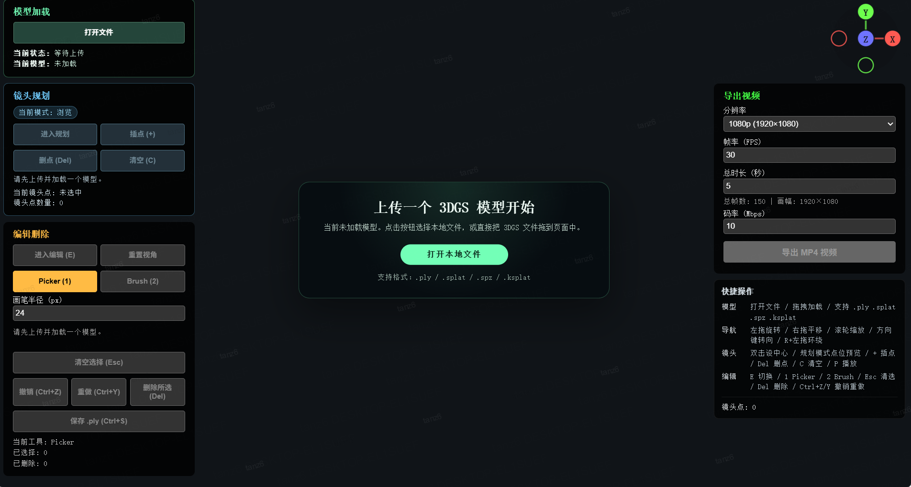

<p align="center">
  
</p>

<p align="center">
  <a href="./README.md">English</a> | 简体中文
</p>

> 不仅仅是查看器：在浏览器中直接展示、清理、规划并导出 3D Gaussian Splatting 场景

[](./LICENSE)
[](https://github.com/sparkjsdev/spark)

`3DGS Studio` 是一个纯浏览器端的 3D Gaussian Splatting (3DGS) 轻量工作台。相比于传统的单机查看工具，它专注于场景展示与二次创作流程，让你能够方便地在网页中载入模型、剔除噪点、规划相机运镜，并直接导出 MP4 演示视频。

仓库默认语言现已切换为英文，网页右上角提供 `EN / 中文` 切换按钮；本中文版 README 和使用指南会继续保留。

## 界面预览

当前预览资源仍是中文界面版本，因此已统一改名为带 `-zh-CN` 后缀的文件，便于后续补充英文截图。



## 动态演示


## 核心特性

- 基于 Pivot 的镜头规划与 MP4 视频导出
- 浏览器内的 splat 删除编辑，支持 `Picker` 与 `Brush`
- 多步骤撤销 / 重做，适合反复清理场景
- 一键导出当前可见 splats 为干净的 `.ply` 文件
- 支持拖拽本地 `.ply`、`.splat`、`.spz`、`.ksplat` 文件
- 自动将上传模型的场景主平面对齐到世界坐标系

## 快速开始

### 1. 环境准备

- 推荐使用支持 `WebCodecs` 的现代浏览器，例如 Chrome / Edge
- 项目需要通过 HTTP 服务启动，请勿直接双击打开 `index.html`

### 2. 启动服务

```bash
python -m http.server 8080
```

然后访问 `http://localhost:8080`。

### 3. 一分钟上手

1. 点击 `Open File`，或直接把本地 3DGS 文件拖到页面中。
2. 双击你想聚焦的主体，设置 `Pivot`（旋转中心）。
3. 进入规划模式后按 `+`，从当前机位插入镜头点。
4. 按 `P` 预览整条路径，微调运镜效果。
5. 按 `E` 进入编辑模式，用 `Picker` 或 `Brush` 清理噪点。
6. 在右上角面板导出最终 MP4 视频。

## 详细文档

- English guide: [docs/guide.md](./docs/guide.md)
- 中文指南: [docs/guide.zh-CN.md](./docs/guide.zh-CN.md)

## 演进路线

- [ ] 支持通过 URL 载入远程模型文件，实现项目的快速在线分享
- [ ] 支持加载多个模型并进行 Before / After 对比审阅
- [ ] 引入 Vite 等现代构建工具，并将 `viewer.js` 拆分为模块
- [ ] 增强编辑能力，例如 3D 裁切盒剔除与局部 ROI 提取

## 致谢

- [Spark.js](https://github.com/sparkjsdev/spark) (by World Labs)
- [Three.js](https://github.com/mrdoob/three.js)
- [mp4-muxer](https://github.com/Vanilagy/mp4-muxer)

## 许可证

本项目采用 [MIT License](./LICENSE) 开源。
